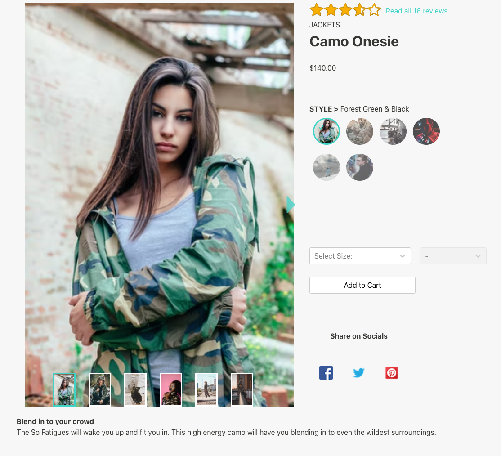
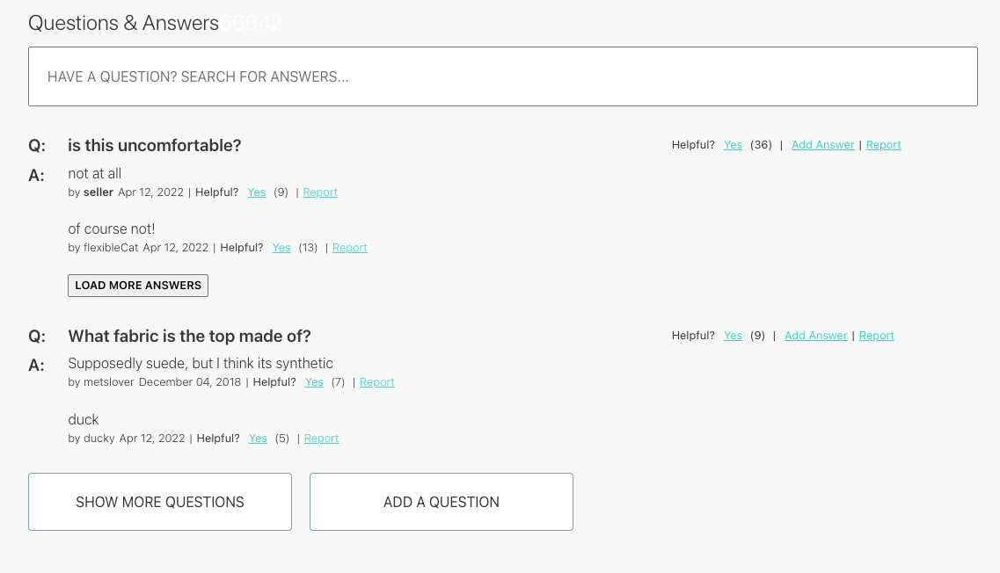
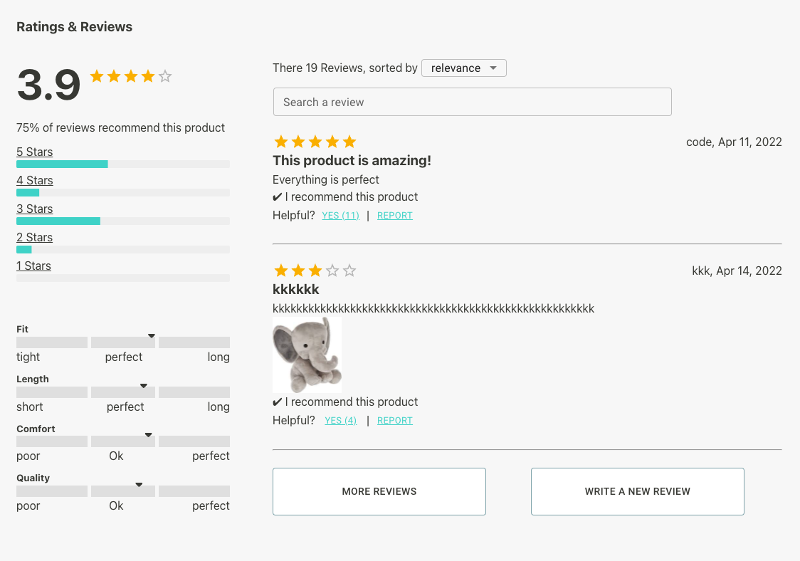

<div align="center">


# Project Atelier 
 

This our first group project (Front-End Capstone) in Hack Reactor.

An e-commerce site

[Description](#Description) •
[Installation](#Installation) •
[Usage](#Usage) •
[Tech-Stack](#Tech-Stack) •
</div>


## Description:


The app emulates an e-commerce site with 4 sub-components:

#### Overview:

- Provides an image gallery with responsive thumbnails, main carousel, and expanded image zoom view
- Rating summary and link to read all reviews
- Product information: category, name, price, style name
- Style selector: thumbnails to switch between different styles
- Add to cart: Select dropdowns for size and quantity, POST request on cart submission
- Share on socials: icon links to share the product on different social media websites
- Employs React, JavaScript, CSS, and React libraries: react-alice-carousel, react-inner-image-zoom, react-gallery-carousel, react-select



#### ~~Related Items~~

- ~~Not implemented - group of 3~~

#### Questions and Answers:

- displays questions and answers in collapsible window, sorted by helpful reviews voting
- modal forms for adding questions and answers. Form for answers includes an option to add photos. Currently cannot display uploaded local files (API constraint)
- contains a search bar
- employs React, vanilla JS, and CSS; axios for requests sent to the API



#### Ratings and Reviews:

- Allow users to see ratings and reviews for a given product.
- Provide a quick overview of ratings on different features of the product (e.g. size, quality..)
- Allow user to search and filter reviews.
- techs used: React, vanilla JavaScript, CSS, and MUI.




> Additionally, the app also contains a user interaction tracking feature, using React higher order components.


## Installation:

### *Step1: Clone the repo to your local*

```shell
# clone
git clone https://github.com/Fec4-Jupiter/webApp.git
```


### *Step2: Set up .env variables*

1. Change directory to repo's root
2. Create a `.env` file

```js
// set up .env
API_TOKEN = "Github_Token"
PORT = [Your_Port]
```


### *Step3: Install all necessary dependencies*

```shell
# Install using npm
npm install

# or using yarn
yarn install
```


## Usage:

1. make wepack transpiling react automatically

```shell
npm run react-dev 
```

2. open localhost server

```shell
npm run server-dev
```


## Tech-Stack:

#### Front-end:React with lazy-loadingCSS

- React with lazy-loading
- CSS

#### Back-end:

- [Webpack](https://webpack.js.org/) for bundling
- [Express server](https://expressjs.com/)  serving Gzipped static files and compressed requests / responses with express-static-Gzip and compression
- [Axios](https://axios-http.com/) for HTTP throughout

#### Test:

- [Jest](https://jestjs.io/) and [React Testing Library](https://testing-library.com/docs/react-testing-library/intro/)
- [CircleCI](https://circleci.com/signup/?utm_source=google&utm_medium=sem&utm_campaign=sem-google-dg--uscan-en-brandAuth-maxConv-auth-brand&utm_term=g_e-circleci_c__pipeline_20210603&utm_content=sem-google-dg--uscan-en-brandAuth-maxConv-auth-brand_keyword-text_eta-circleCI_exact-&gclid=Cj0KCQjw0umSBhDrARIsAH7FCocB3Ij1dtG1WecNr33gZJTvqFH12r4IB5ZiRZg5DNHbXAOv5AlWxrAaAn0NEALw_wcB) for continuous intergration testing on Github deployment

